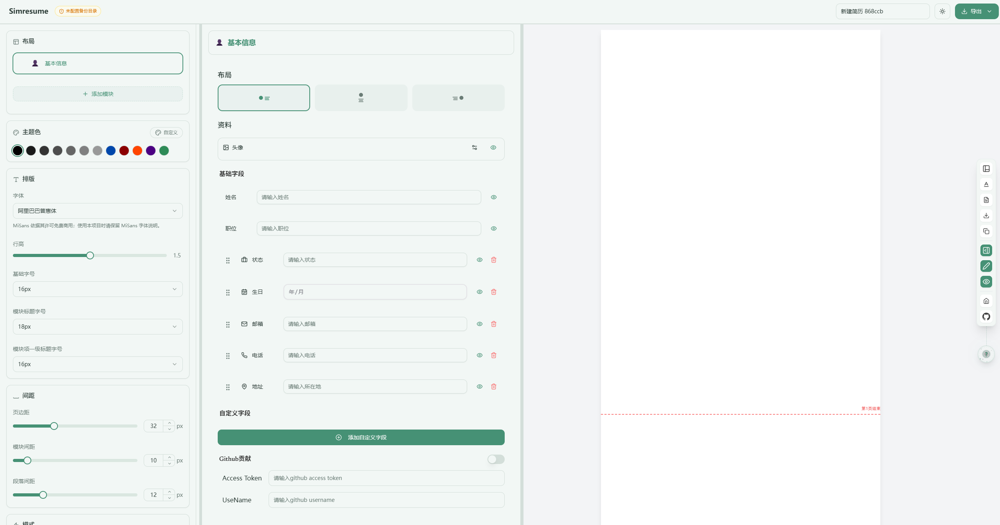

<div align="center">

# ☁️ Simresume

<a href="https://github.com/JOYCEQL/simresume/blob/main/LICENSE">
  
</a>
<a href="https://tanstack.com/start/latest">
  
</a>
<a href="https://framer.com/motion">
  
</a>

<a href="https://trendshift.io/repositories/13077" target="_blank">
  
</a>

[简体中文](./README.zh-CN.md) | English

</div>

---

> A gentle, intuitive resume editor that turns your stories into elegant documents.
>
> *Evolved from Magic Resume*

## ✦ Preview

<p align="center">
  
</p>

## ✦ Features

<table>
<tr>
<td width="50%">

### 🤖 AI Assistant

- **Smart Polish** — Refine your content with AI-powered suggestions
- **Grammar Check** — Real-time error detection with one-click fixes
- **Custom Instructions** — Personalized AI behavior for your needs
- **Multi-Model Support** — OpenAI, Gemini, DeepSeek, Doubao

</td>
<td width="50%">

### 📐 Templates

- **8 Professional Designs** — Classic, Modern, Creative, Elegant, Editorial, Minimalist, Left-Right, Timeline
- **Live Preview** — See changes instantly as you type
- **One-Click Switch** — Change templates without losing content

</td>
</tr>
<tr>
<td width="50%">

### ✏️ Rich Editing

- **Rich Text Editor** — Format with lists, links, highlights, colors
- **Drag & Drop Sections** — Reorder with ease
- **Custom Fields** — Add personalized information fields
- **Certificates Section** — Showcase your achievements with images

</td>
<td width="50%">

### 📤 Export & Sync

- **PDF Export** — Crisp, print-ready documents
- **Markdown Export** — Portable, version-control friendly
- **Local Storage** — Data stays on your device
- **File Sync** — Optional backup to local folder

</td>
</tr>
<tr>
<td width="50%">

### 🎨 Customization

- **Theme Colors** — Choose your accent color
- **Dark Mode** — Easy on the eyes
- **Font Selection** — Multiple typeface options
- **Spacing Controls** — Fine-tune your layout

</td>
<td width="50%">

### 🌐 Experience

- **Bilingual** — Chinese & English interfaces
- **Auto One-Page** — Smart content fitting
- **Responsive Design** — Works on desktop and mobile
- **Auto-Save** — Never lose your work

</td>
</tr>
</table>

## ✦ Tech Stack

| Category | Technologies |
|----------|-------------|
| Framework | TanStack Start, React 18, TypeScript |
| Styling | Tailwind CSS, Framer Motion, Shadcn/ui |
| Editor | Tiptap v3 |
| State | Zustand |
| Icons | Lucide React |

## ✦ Quick Start

```bash
# Clone the repository
git clone git@github.com:JOYCEQL/simresume.git
cd simresume

# Install dependencies
pnpm install

# Start development server
pnpm dev
```

Visit `http://localhost:3000` to start creating your resume.

## ✦ Build & Deploy

```bash
# Production build
pnpm build

# Start production server
pnpm start
```

### Docker

```bash
docker compose up -d
```

## ✦ Roadmap

- [x] AI-assisted writing
- [x] Multi-language support (zh/en)
- [x] 8 resume templates
- [x] Custom AI model configuration
- [x] Auto one-page layout
- [x] Markdown export
- [ ] More export formats (Word, HTML)
- [ ] Import PDF & Markdown
- [ ] Online resume hosting

## ✦ License

This project is open-sourced under the **Apache 2.0** license with commercial use restrictions.

- **Personal Use** — Free for personal, non-commercial purposes
- **Commercial Use** — Requires a commercial license for SaaS, enterprise, or any profit-oriented use

See [LICENSE](LICENSE) for details.

## ✦ Contact

| Platform | Link |
|----------|------|

| Email | <2259096680@qq.com> |

---

<div align="center">

If you find this project helpful, consider giving it a ⭐

**[Sponsors](https://github.com/JOYCEQL/simresume#sponsors)** · **[Report Bug](https://github.com/JOYCEQL/simresume/issues)** · **[Request Feature](https://github.com/JOYCEQL/simresume/issues)**

</div>
